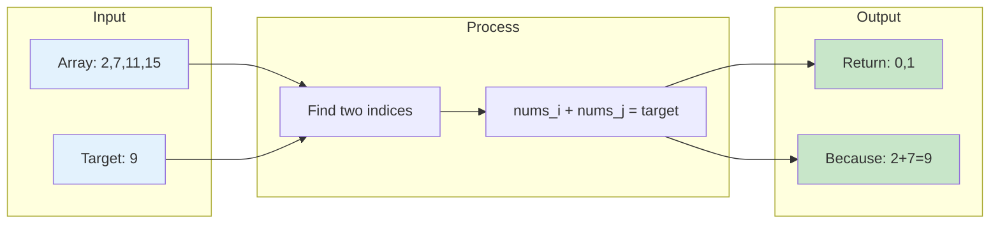
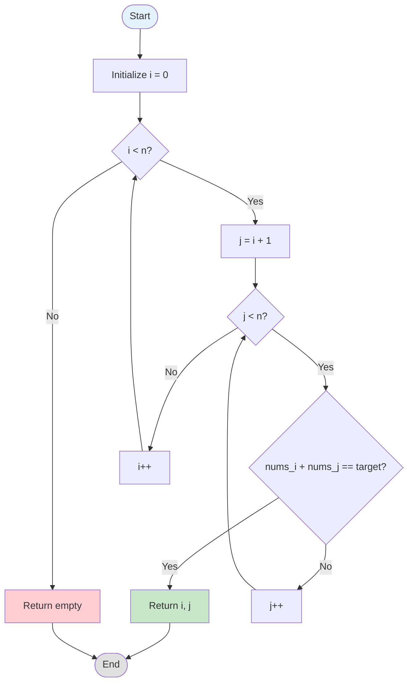
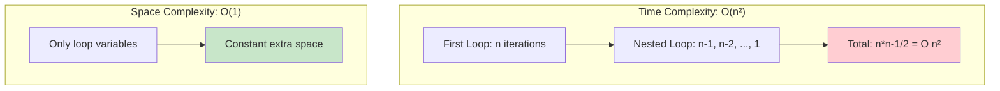
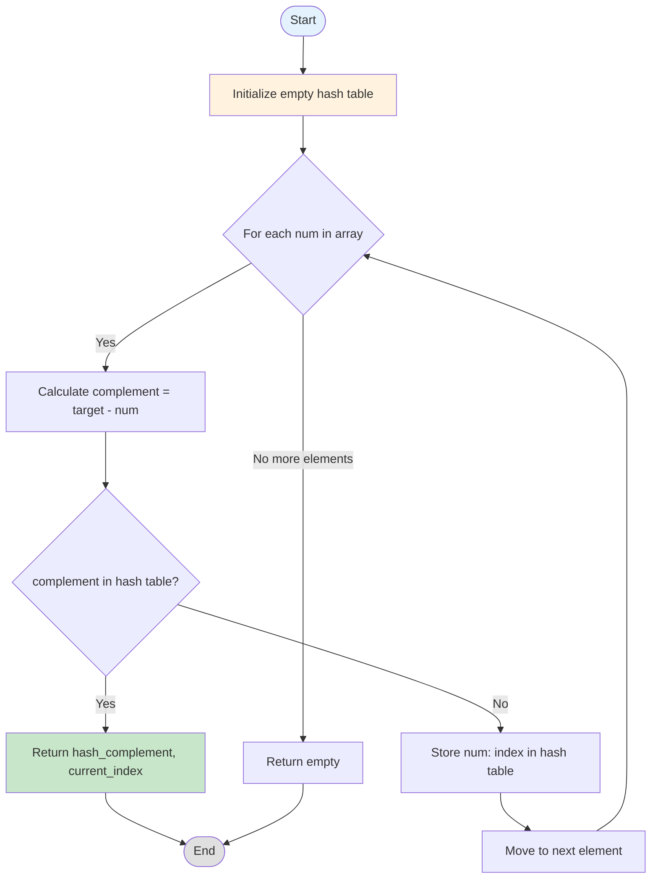
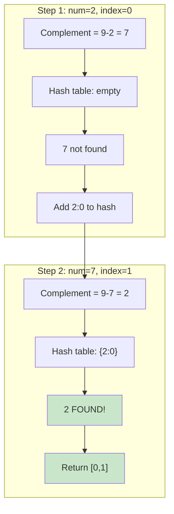
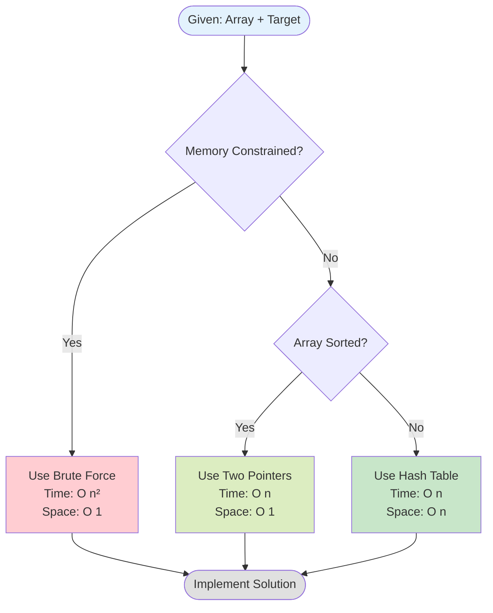
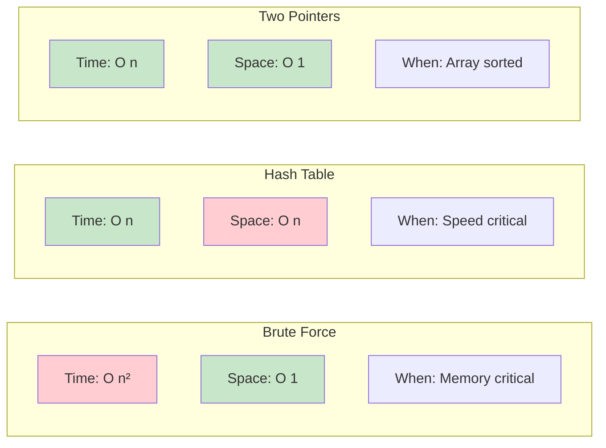
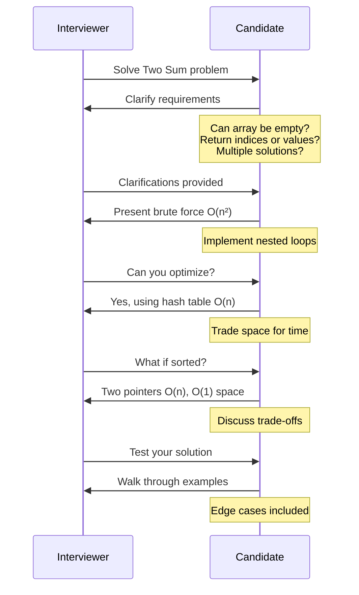
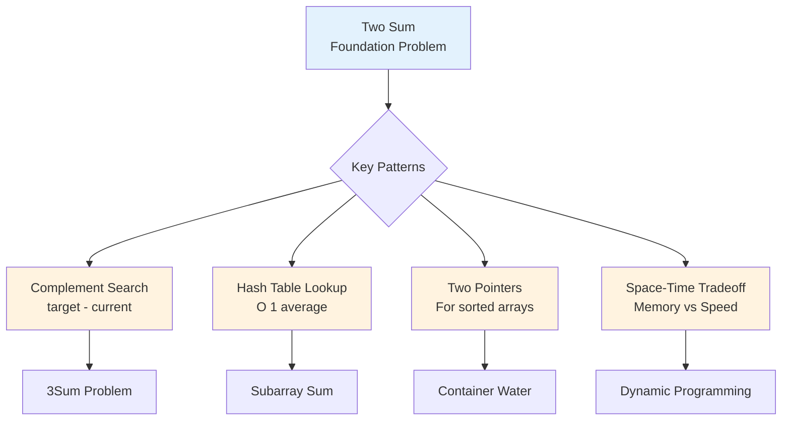

# Day 1: Two Sum - Mermaid Visualizations

## 1. Problem Overview



## 2. Brute Force Approach



### Brute Force Complexity



## 3. Hash Table Approach



### Hash Table Step-by-Step Example



## 4. Algorithm Selection Flowchart



## 5. Complexity Comparison



## 6. Interview Communication Flow



## 7. Test Cases Coverage

```mermaid
mindmap
  root((Test Cases))
    Basic
      [2,7,11,15], target=9
      [3,2,4], target=6
    Edge Cases
      Duplicates
        [3,3], target=6
      Negatives
        [-1,-2,-3,-4,-5], target=-8
      Zeros
        [0,4,3,0], target=0
      Min Size
        [1,2], target=3
    Boundaries
      Large Numbers
        [10^9, -10^9], target=0
      Large Array
        10,000 elements
```

## 8. Pattern Recognition



## Rendering Instructions

### For GitHub
GitHub automatically renders Mermaid diagrams in markdown files.

### For Local Development
1. **VS Code**: Install "Markdown Preview Mermaid Support" extension
2. **Command Line**: Use `mermaid-cli` to generate images:
   ```bash
   npm install -g @mermaid-js/mermaid-cli
   mmdc -i diagrams.md -o output.png
   ```

### For Blog Posts
1. **Medium**: Use mermaid.live to generate SVG/PNG
2. **Dev.to**: Supports Mermaid natively
3. **Personal Blog**: Include mermaid.js library

### For Videos
1. Use mermaid.live to export as PNG/SVG
2. Import into video editing software
3. Or screen record the live rendering

## Color Scheme Reference
- `#E3F2FD` - Light Blue (Input/Start)
- `#C8E6C9` - Light Green (Success/Optimal)
- `#FFCDD2` - Light Red (Inefficient/Error)
- `#FFF3E0` - Light Orange (Process/Warning)
- `#E0E0E0` - Light Gray (Neutral/End)
- `#DCEDC1` - Light Lime (Alternative)